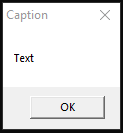

# sample

Fooling around with [Rust for Windows](https://github.com/microsoft/windows-rs) following its [Youtube video](https://www.youtube.com/watch?v=-oZrsCPKsn4)


[app.png](images/app.png)

## Toolchain

In order not to depend on Visual Studio, do not forget to add as default toolchain *stable-x86_64-pc-windows-gnu* and remove any *-msvc* if any:
```
rustup target add x86_64-pc-windows-gnu
rustup toolchain install stable-x86_64-pc-windows-gnu
rustup default stable-x86_64-pc-windows-gnu
# rustup toolchain remove stable-x86_64-pc-windows-msvc
```

Double check your OK to go:
```
rustup show
Default host: x86_64-pc-windows-msvc
rustup home:  C:\Users\user\.rustup

stable-x86_64-pc-windows-gnu (default)
rustc 1.52.1 (9bc8c42bb 2021-05-09)
```

## More dependencies to be avoided

Building with static version of the libraries might make it easier to deploy:

~/.cargo/config
```
[target.x86_64-pc-windows-msvc]
rustflags = ["-Ctarget-feature=+crt-static"]

[target.x86_64-pc-windows-gnu]
rustflags = ["-Ctarget-feature=+crt-static"]
```
